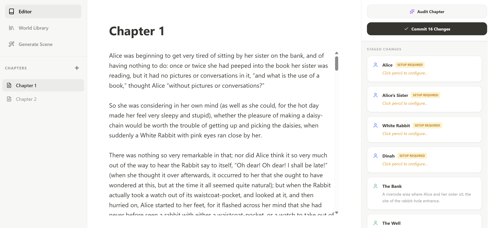
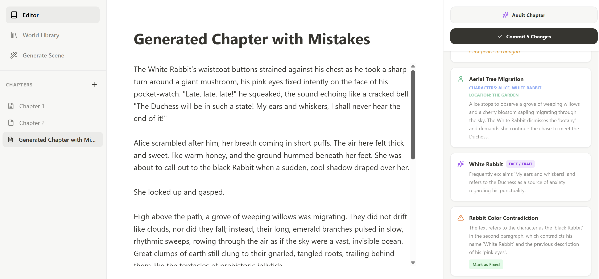
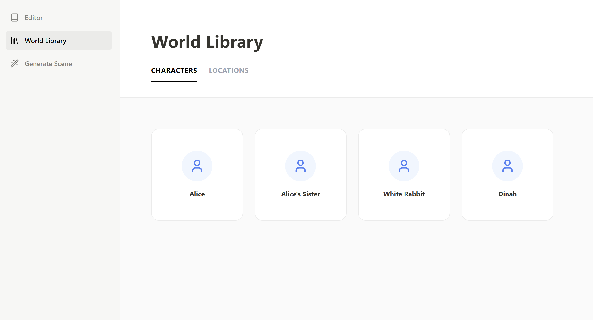
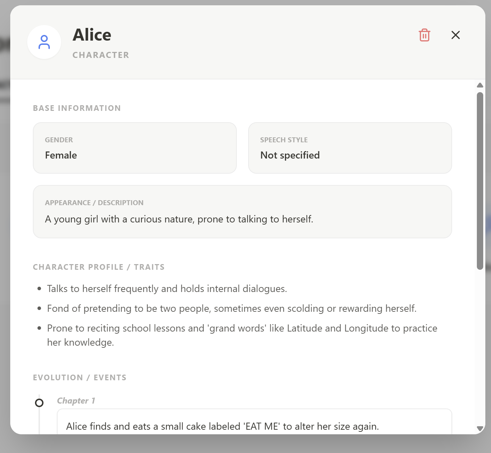
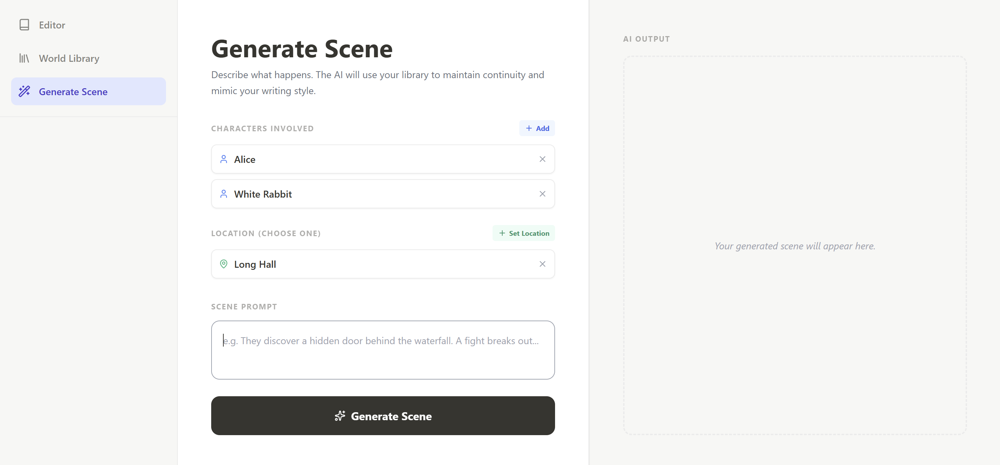

# StoryForge — AI Co-Author with a Knowledge Graph
 
 
A full-stack writing assistant for novelists that keeps a **living knowledge graph** of your story's world. As you write, the app uses an LLM to read each chapter, automatically extract characters, locations, events, and traits, and store them as a connected graph in **Neo4j**. That graph then feeds back into the AI — so both **lore-consistency checking** and **new-scene generation** are grounded in what has actually happened in your story so far.
 
This is a **Graph-RAG** system: instead of feeding the whole manuscript to the model, it retrieves only the relevant entities and their history from the graph and injects them into the prompt as context.

 
---
 
## Screenshots
 
### Editor + live AI audit
Write chapter by chapter. The **Audit Chapter** button analyzes the text against existing lore and stages the characters, locations, and events it detects — ready to commit into the graph.
 

 
### Contradiction detection (the core idea)
Here a chapter was generated with **deliberate mistakes**. The audit not only extracted a new event and a character trait, but flagged a **contradiction** — the text calls the character the "black Rabbit," conflicting with the established "White Rabbit" with pink eyes — and offers to mark it fixed.
 

 
### World Library
Every committed entity, organized into Characters and Locations.
 

 
### Character profile with an evolving timeline
Each entity has base info, AI-extracted behavioral traits, and a chapter-by-chapter timeline of events it participated in — all reconstructed from the knowledge graph.
 

 
### Graph-RAG scene generation
Select characters and a location from the library, describe what happens, and the backend pulls their lore + recent story events from the graph to generate a scene that stays consistent with the established world.
 


---
 
## What it does
 
- **Chapter editor** — write your novel chapter by chapter (autosaved locally in the browser).
- **AI Audit** — analyzes the current chapter against the existing world lore and returns a structured list of:
  - new characters, locations, events, and behavioral traits it detected;
  - **contradictions** with established lore (e.g. a character's gender or appearance changing, impossible actions).
- **Commit to graph** — reviewed facts are written into Neo4j as nodes and relationships (`PARTICIPATED_IN`, `HAS_TRAIT`, `HAPPENED_AT`, etc.), building the story's knowledge graph over time.
- **World Library** — browse every entity, view its full timeline of events and its traits, and delete entities.
- **AI Scene Generator** — pick characters/locations from the library and a prompt; the backend pulls their lore and recent story events from the graph (Graph-RAG) and generates a new scene that stays consistent with the established world. Optional style reference to match tone.
---
 
## Architecture
 
```
┌──────────────┐        REST         ┌──────────────────┐        ┌──────────────┐
│  Frontend    │  ───────────────▶   │  Backend         │  ────▶ │   Neo4j      │
│  React + TS  │  ◀───────────────   │  FastAPI (Python)│  ◀──── │ Graph DB     │
│  Vite +      │                     │                  │        │ (characters, │
│  Tailwind    │                     │  Gemini LLM      │        │  events,     │
└──────────────┘                     │  (extract + gen) │        │  lore graph) │
                                     └──────────────────┘        └──────────────┘
```
 
- **Frontend:** React 18 + TypeScript, Vite, Tailwind CSS, Framer Motion. Chapters persist in `localStorage`; everything else lives in the graph via the API.
- **Backend:** FastAPI (Python). Talks to the Gemini API for entity extraction and scene generation, and to Neo4j for storing/retrieving the knowledge graph.
- **Database:** Neo4j graph database (run via Docker).
### Key API endpoints
 
| Method | Endpoint | Purpose |
|--------|----------|---------|
| `POST` | `/audit` | Analyze chapter text, extract entities & detect contradictions |
| `POST` | `/commit_all` | Persist reviewed facts into the graph |
| `GET`  | `/library` | List all entities |
| `GET`  | `/entity_history/{name}` | Timeline + traits for one entity |
| `DELETE` | `/entity/{name}` | Remove an entity |
| `POST` | `/generate` | Graph-RAG scene generation |
 
---
 
## Tech Stack
 
**Frontend:** React 18, TypeScript, Vite, Tailwind CSS, Framer Motion, lucide-react
**Backend:** Python, FastAPI, Uvicorn, google-generativeai (Gemini), Neo4j Python driver, python-dotenv
**Database:** Neo4j (graph)
 
---
 
## Getting Started
 
### Prerequisites
- **Docker** (for the Neo4j database)
- **Python 3.10+** (backend)
- **Node.js 18+** (frontend)
- A **Gemini API key** ([Google AI Studio](https://aistudio.google.com/))
### 1. Start the database (Neo4j)
 
```bash
docker run --name neo4j-diploma \
  -p 7474:7474 -p 7687:7687 \
  -d --env NEO4J_AUTH=neo4j/password \
  neo4j:latest
```
 
### 2. Start the backend (FastAPI)
 
```bash
cd backend
pip install -r requirements.txt   # or: pip install fastapi uvicorn google-generativeai pydantic neo4j python-dotenv
 
# create a .env file (see Configuration below), then:
python main.py
```
 
The backend runs on `http://127.0.0.1:8888`.
 
### 3. Start the frontend (React + Vite)
 
```bash
cd frontend
npm install
npm run dev
```
 
Open the URL shown in the terminal (usually `http://localhost:5173`).
 
---
 
## Configuration
 
Change Api Key in backend/main.py file.
---
 
 
## Author
 
*Kristiina Dunajeva* (TalTech, Computer Science).